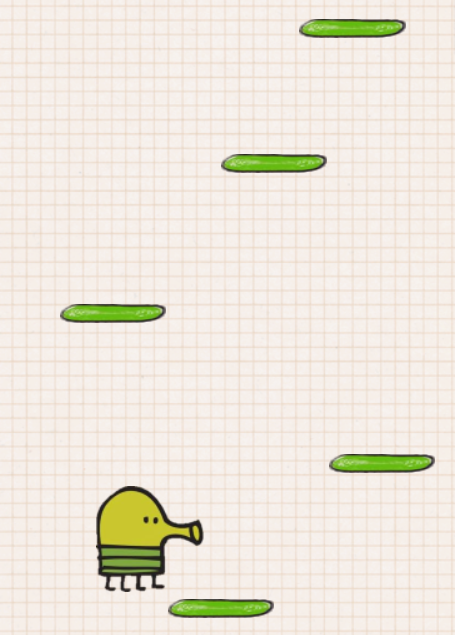

# doodle-jump

This is my take on the Doodle jump game. The doodler can jump from platform to platform and score points while doing so. This was really fun to make. Thank you to Ania Kubow for the cool video that inspired me to create this

# Environment Setup
1. Clone my repo at https://github.com/davidmstanleyjr/doodle-jump

2. CD into it and click "run in default browser" from the index.html file.

# Technologies Used
1. HTML
2. CSS
3. Javascript

# Issues
The biggest problem I had was getting the doodler to stop making such jerky movements while moving left to right. I solved this by using the clear interval method. This stopped movement to one side when you attempt to move to another side.

# Screenshots

# Live Page

Here is a link to the deployed site
https://davidmstanleyjr.github.io/doodle-jump/